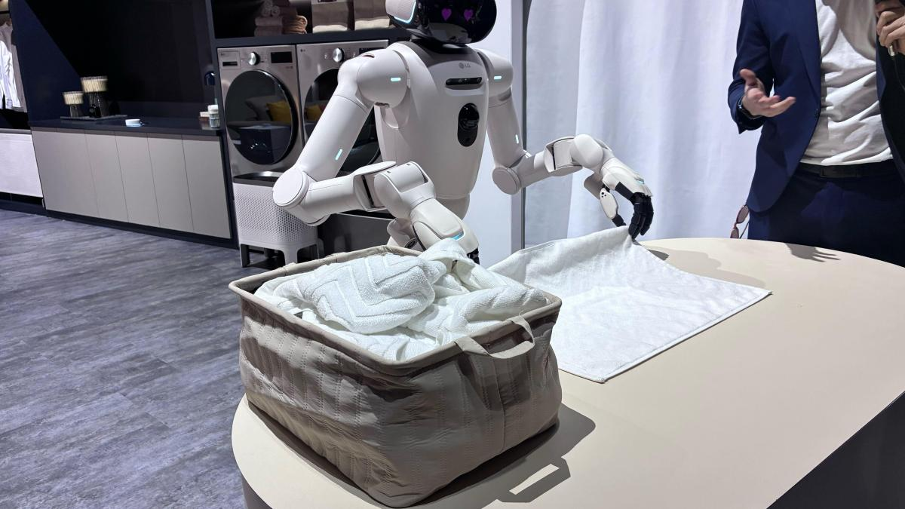

# Learning World Models

## Context

I am Guillermo, a **Data Scientist** who has spent most of his career building **Recommender Systems** and **Rankings**. Lately, however, I've been more interested in what people call **Physical AI**.

I agree with the view that as AI gets more capable, the next breakthrough is to make it act in the real world, physically. This is a viral quote that perfectly resonates with my thinking:

<i>"I want AI to do my laundry and dishes so that I can do art and writing, not for AI to do my art and writing so that I can do my laundry and dishes."</i> (<a href="https://x.com/AuthorJMac/status/1773679197631701238">Joanna Maciejewska</a>)

_LG's CLOiD robot, folding clothes. Source: CNET.com, as credited in [my Substack post](https://guillelahuerta.substack.com/p/how-dreamerv3-dreams)._

## Why DreamerV3

The problem was that I didn't know where to start. I have no experience in Robotics or Reinforcement Learning, so I was a bit lost. After doing some research, I found that one of the bottlenecks in Physical AI is **data collection**, and one of the ways to overcome this limitation is to use **World Models**, which basically allow you to predict how the environment changes given an agent's action.

That led me to the DreamerV3 paper, [Mastering Diverse Domains through World Models](https://arxiv.org/abs/2301.04104), by researchers at DeepMind and the University of Toronto. It introduces an RL agent that uses a World Model to train on imagined sequences, and that outperformed specialised methods across more than 150 tasks with a fixed set of hyperparameters. Given how widely cited the paper was, and also out of the respect I have for DeepMind's work, it seemed like a great place to start.

However, understanding it proved harder than expected, probably because I was lacking some basic concepts about RL and World Models. This repository is my attempt to share **simplified explanations** that may be useful for anyone willing to learn more about Physical AI, without having any prior RL/Robotics experience. Writing them also helps me internalise the concepts and learn in the process.

DreamerV3 later led me to a second paper, [R2-Dreamer: Redundancy-Reduced World Models without Decoders or Augmentation](https://openreview.net/forum?id=Je2QqXrcQq), which changes how the World Model learns its visual representation. For my study, I will use its authors' [NM512/r2dreamer](https://github.com/NM512/r2dreamer) codebase. It already includes both an R2-Dreamer configuration and a DreamerV3 baseline, and it is written in PyTorch, which I am more familiar with than JAX. That baseline is their reproduction of DreamerV3, rather than the original JAX implementation.

## Objective

This repository will be a summary of my personal study to understand the DreamerV3 and R2-Dreamer papers. I plan to compare the `DreamerV3` baseline implemented in [NM512/r2dreamer](https://github.com/NM512/r2dreamer) with `R2-Dreamer` on a simple visual task. I will document my progress here, and I hope **this could be useful for anyone else trying to get started in this field**. If it is, please feel free to reach out to me, for example, via [Linkedin](https://www.linkedin.com/in/guillermo-lahuerta/).

## How to follow along

I will update this repo as I go with what I learned, what worked and what did not. The log below is kind of a **diary of the project**.

Note that **I do not commit to a fixed schedule**, so updates will be irregular. Basically I plan to work on this whenever I have free time.

---

## Log

### July 5th, 2026

I have started by creating this repo and writing this initial README to summarize this project (which for sure will evolve over time). My next step is to read the DreamerV3 paper to understand the model, and separately inspect `r2dreamer`, the codebase from the R2-Dreamer paper.

### July 25th, 2026

The last couple of weeks, I have focused on learning the basics of the two papers. Find my summaries in the following links:

- [docs/how-dreamerv3-works.md](docs/how-dreamerv3-works.md)
- [docs/how-r2-dreamer-works.md](docs/how-r2-dreamer-works.md)

### September 18th, 2026

I have published my Substack post: [**How DreamerV3 dreams**](https://guillelahuerta.substack.com/p/how-dreamerv3-dreams). It is a simplified guide to the World Model, using Atari's Breakout to explain the recurrent state, the stochastic representation, and how the model learns to imagine.

The post covers the World Model; the Critic and Actor are still to come on Substack. The [repository guide](docs/how-dreamerv3-works.md) now includes draft sections on both, alongside the technical explanation from the published post.

_The two components of the model state. Source: diagram generated with Claude Design for the Substack post._

---

## References

Some of the material that got me started, in case it is useful for someone else:

### Videos

- [Yann LeCun's $1B Bet Against LLMs, Part 1](https://www.youtube.com/watch?v=kYkIdXwW2AE&t=1738s) and [Part 2](https://www.youtube.com/watch?v=v_jDvpEGTIg&t=150s), by Welch Labs. On why LeCun thinks the next step for AI is World Models, not bigger LLMs.
- [Robotics' End Game: Nvidia's Jim Fan](https://www.youtube.com/watch?v=3Y8aq_ofEVs), by Sequoia Capital. On where robotics is going and the role of simulation and foundation models.

### Blogposts

- [World Models](https://worldmodels.github.io/), by Ha and Schmidhuber (2018). The interactive article that made the term popular. An agent learns to drive and to play Doom inside its own dream.
- [World Models](https://rohitbandaru.github.io/blog/World-Models/), by Rohit Bandaru. A long technical tour of World Model architectures, including the RSSM used by Dreamer, and newer ones like JEPA, Genie and Cosmos.
- [Introducing GAIA-1](https://wayve.ai/thinking/introducing-gaia1/), by Wayve. A generative World Model for self-driving, and a good example of these ideas applied in industry.

### Papers

- [Mastering Diverse Domains through World Models](https://arxiv.org/abs/2301.04104), by Hafner et al. This is the DreamerV3 paper and the conceptual foundation of the study. The author's [project page](https://danijar.com/project/dreamerv3/) has the uncut videos of the Minecraft diamond runs.
- [R2-Dreamer: Redundancy-Reduced World Models without Decoders or Augmentation](https://openreview.net/forum?id=Je2QqXrcQq), by Morihira et al. (ICLR 2026). This separate paper introduces R2-Dreamer and the `r2dreamer` PyTorch codebase used for the experiments.
