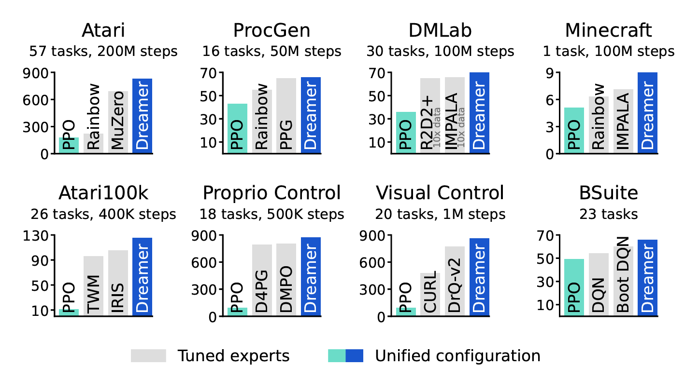
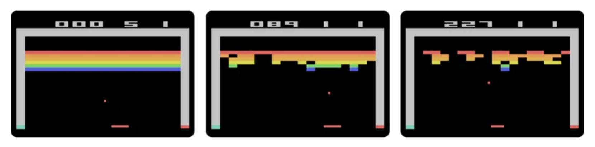
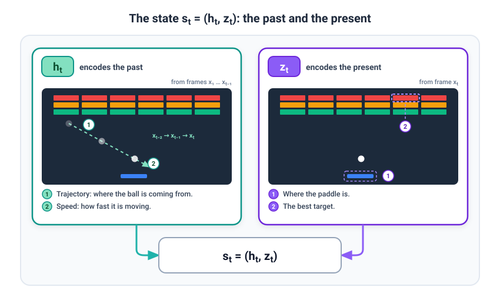
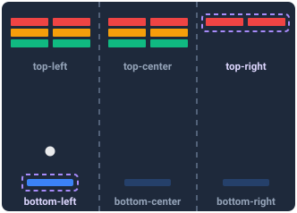
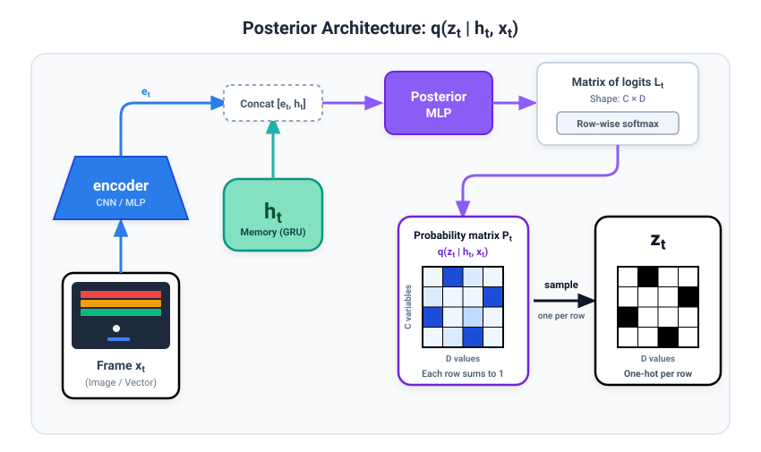
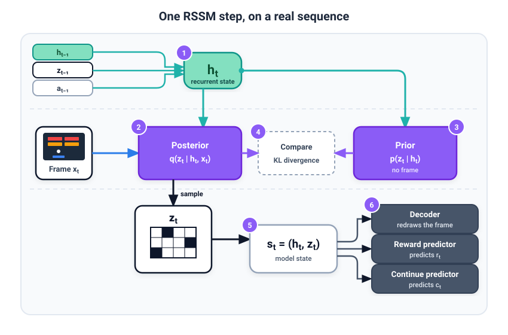
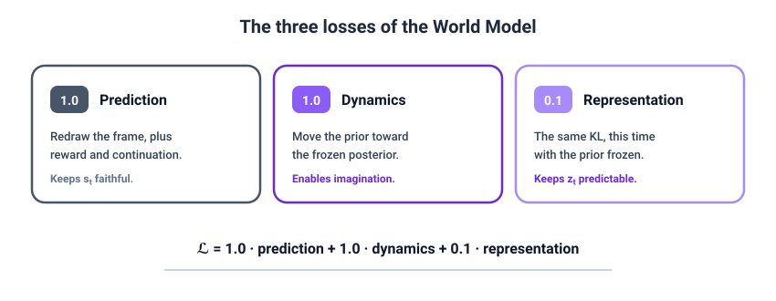
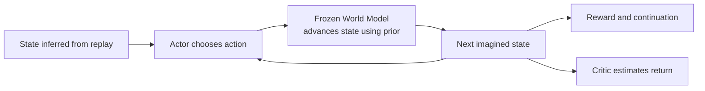
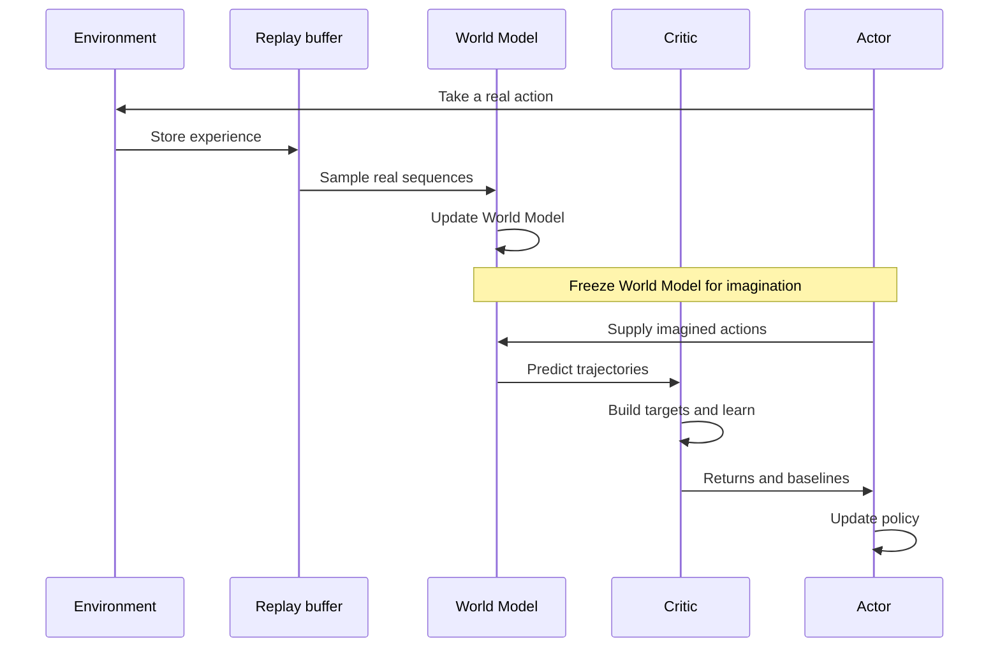

# How DreamerV3 works

_The World Model explanation below is adapted from my Substack post, [How DreamerV3 dreams](https://guillelahuerta.substack.com/p/how-dreamerv3-dreams), published on September 18th, 2026. This repository version also includes draft sections on the Critic and Actor, which I have not yet published on Substack._

## The model

DreamerV3 is a **Reinforcement Learning agent** that uses a World Model to “imagine” (or “dream”, hence the name) sequences of actions and their consequences. One thing to remember is that, in DreamerV3, those **imagined sequences are only used for training**. At inference, the model takes whatever action is chosen by its **Actor's policy** (no imagination involved).

One of the main achievements of DreamerV3 was that, given a **fixed set of hyperparameters**, it worked remarkably well across more than **150 tasks**, such as playing Atari games or Minecraft, and was able to beat popular RL algorithms such as **PPO**.



_Figure 1: Dreamer outperformed tuned algorithms across a wide range of benchmarks and substantially outperformed PPO. Source: Figure 1 from the arXiv version of the DreamerV3 paper._

### Dreamer's 3 main components

Let's start by presenting the three components of DreamerV3:

1. **The World Model**: its purpose is to predict the next state of the environment given an action. This gives the model the capability to “imagine” sequences and train its policy on them.
2. **The Critic**: its role is to judge how valuable a state is, not in the short term but in the long run. Think of it as a chess player assessing the potential of a chess board.
3. **The Actor**: it is the agent taking the actual actions based on its trained policy.

All three components are built from **Neural Networks**, and although they complement each other, each one is trained with a different objective and on different data. They are all updated throughout training, but in different stages:

1. The **World Model** is updated first, using **real sequences** of **input data** (e.g., video frames), **actions** and **rewards**.
2. Then, the World Model is **frozen**, and used to generate imagined trajectories. The **Critic** is trained primarily on those “dreams” to predict the **long-term value** of a state (using again the chess analogy, the Critic might realise that sacrificing a pawn now gives us a better chance of winning the game later).
3. The **Actor** is also trained on those same imagined trajectories, to learn a **policy** that selects the actions leading to higher **long-term returns**.


_Figure 2: Training process of DreamerV3. The World Model is trained on real data; the Actor and Critic learn primarily from imagined sequences. The Critic also has a replay-based training objective, explained below. Source: Figure 3 from the arXiv version of the DreamerV3 paper._

We will go into each one of these components, but for now, just keep the idea that these three components are **Neural Networks trained with different loss functions**.

## The World Model

Let's look at the first component, the World Model. Recently I watched a [video from Welch Labs](https://www.youtube.com/watch?v=kYkIdXwW2AE) where they had Yann LeCun presenting his JEPA model, and he shared this quote that I think summarises pretty well why a World Model is useful:

> “I do not understand how you can even think of building an agentic system without that system having the ability of predicting the consequences of its actions.”
>
> — Yann LeCun

This quote is taken in the context of LeCun explaining the limitations of LLMs. I would take it with a pinch of salt because he is also making the case for his own approach to AI. So he has a vested interest in selling this idea.

In any event, World Models are powerful tools that allow us to **generate more training experience**, grounded in the dynamics of the environment they were trained on. This is very convenient in environments where acting by “trial and error” is either too costly or dangerous. Of course, the model's predictions are only an approximation of those dynamics, and they can be wrong.

This section covers what Dreamer's World Model looks like, what its components are, and how it is trained.

### RSSM

From an architecture point of view, the World Model is a **Recurrent State-Space Model** (RSSM). This is a fancy name for an architecture that represents the state of the environment as the combination of two things:

```math
s_t = (h_t, z_t)
```

- The **recurrent state** $h_t$, whose mission is to encode the **past**.
- The **stochastic representation** $z_t$, whose objective is to represent the **present**.

My definition is probably far too simplistic, but let's use an example so that it's easier for you to understand what I mean.

In the figure below, there are three different frames of **Breakout**, a popular Atari game:



_Figure 3: Example of Atari's Breakout game. Source: Atari's website, as credited in the Substack post._

The objective of the game is as simple as moving the paddle at the bottom to bounce the ball back and hit the coloured bricks. Depending on the colour, the reward is higher (e.g., red bricks give you more points than the green ones).

Note that a video frame at time $t$ (denoted as $x_t$) is not enough to accurately decide what to do, because with a single image it is impossible to know where the ball is coming from (meaning, its trajectory), or what its speed is. To play properly, we also need to encode what happened before we took the screenshot. In this example:

- $h_t$ should encode, for example, the **trajectory** and **speed** of the ball.
- $z_t$ should encode the position of the **paddle**, or where the best **targets** are now.

Note that I used the word “should” in both cases. This is because nobody tells the model what to encode specifically. The hope is that with enough data, that's what the model will converge to.



_Figure 4: The two components of the model state, illustrated as encoding the past and the present. Source: diagram generated with Claude Design._

The model is not explicitly forced to put “past” information in $h_t$ or “current” information in $z_t$, and useful information can **actually be distributed between the two**.

The World Model is therefore an RSSM that encodes the environment at time $t$ as a state $s_t$ made of two elements: $(h_t, z_t)$. The former carries information accumulated from previous frames and actions, and the latter incorporates information from the current frame $x_t$.

But what do these two variables actually look like?

### The recurrent state

Mathematically, $h_t$ is a high dimensional array of floats (if you are familiar with the ML/DL jargon, this is just an **embedding**). It is calculated based on the previous recurrent state ($h_{t-1}$), plus the previous stochastic representation ($z_{t-1}$), plus the previous action ($a_{t-1}$):

```math
h_t = f(h_{t-1}, z_{t-1}, a_{t-1})
```

From an architecture perspective, $f$ is based on a GRU, a type of Recurrent Neural Network that keeps track of the **hidden state** and feeds it back to itself at each step.

And how big is this embedding? Well, for the 200M parameter setup used on most of the paper's benchmarks, $h_t$ has 8192 dimensions. So it's a pretty high dimensional embedding.

### Stochastic representation

The $z_t$ term, in my opinion, is the tricky one to understand. The stochastic representation $z_t$ is (bear with me): a sample taken from a **matrix of softmax probabilities associated with categorical latent variables**.

Probably I've lost you in the last sentence. Let's use our Atari game as an example again, because I promise it's far easier to understand than it seems.

In **Breakout**, imagine that $z_t$ wants to encode the following information:

- The current position of the **paddle**.
- The current position of the best brick to hit (i.e., the **target**).

There would be many more, of course, but let's go on with just these two for simplicity. In this case, the number of **categorical latent variables** would be 2. Now imagine that for each category, we allow three different values:

- Position of the paddle: **{bottom-left, bottom-center, bottom-right}**.
- Position of the target: **{top-left, top-center, top-right}**.



_Figure 5: Example of three possible values for two categorical latent variables. Source: diagram generated with Claude Code._

Note that in both cases I am using “position” as the meaning of the possible values that each categorical latent variable could have, but the model could be encoding literally anything (positions, colours, sizes, etc.).

In this example, we would have a **2 × 3 matrix**, which could encode the following “meaning”:

| Categorical latent variable | Value 1 | Value 2 | Value 3 |
| :---: | :---: | :---: | :---: |
| Paddle position | bottom-left | bottom-center | bottom-right |
| Target position | top-left | top-center | top-right |

Now, let's add some values to make sense of it:

| Categorical latent variable | Value 1 | Value 2 | Value 3 |
| :---: | :---: | :---: | :---: |
| Paddle position | 0.80 | 0.15 | 0.05 |
| Target position | 0.35 | 0.20 | 0.45 |

As you can see, each row adds up to 1. That's because, as I said at the beginning, each row is just the **softmax probability distribution for one latent category**.

The numbers I used in the example, in plain English, mean that the most likely position of the paddle is **bottom-left**, and that the best target is probably in the **top-right**. And I say “probably” to emphasise that this probability matrix, as opposed to the deterministic embedding $h_t$, allows us to encode a certain degree of **uncertainty**.

Two things to emphasise before moving on:

1. Nobody tells the RSSM what should be encoded by this **matrix**. The hope is that with enough data, it will encode useful information. But no one explicitly tells it to encode **the positions of the paddle, the bricks or the ball**. Those concepts can also be spread across several latent variables.
2. This matrix of softmax probabilities is **not $z_t$**. It is a **posterior distribution** that $z_t$ is sampled from. Therefore, $z_t$ is actually a **one-hot matrix**, with just one 1 per row. One possible sample is:

| Categorical latent variable | Value 1 | Value 2 | Value 3 |
| :---: | :---: | :---: | :---: |
| Paddle position | 1 | 0 | 0 |
| Target position | 0 | 0 | 1 |

### The posterior

The matrix of softmax probabilities is generated by the **posterior** $q$, given the frame $x_t$ and the recurrent memory $h_t$:

```math
q(z_t \mid h_t, x_t)
```

In plain English, this translates to: given what happened before ($h_t$) and what I see in the current image ($x_t$), predict the possible values of the paddle position and the targets (i.e., the **categorical latent variables** in our example).

From an architecture point of view, this is how the posterior system looks:



_Figure 6: Posterior architecture. In the diagram, C is the number of categorical variables and D is the number of values per variable. Source: diagram generated with Claude Design._

1. First the **encoder** compresses the frame $x_t$ into an embedding $e_t$ using a **CNN** for input images like the Breakout Atari game (or an **MLP** for vector inputs).
2. Then, that embedding is concatenated with the recurrent state $h_t$, and another **MLP** generates our matrix of logits.
3. We apply a **softmax** over each row (i.e., over each categorical latent variable). This gives the probabilities of our posterior $q(z_t \mid h_t, x_t)$.
4. Finally, we sample from that posterior to get our **stochastic representation** $z_t$, which is a one-hot matrix.

DreamerV3 also mixes a small amount of uniform probability into the distributions, which we will mention again in the robustness section. The diagram leaves that detail out to keep the main idea visible.

Before moving on, let's emphasise something very important:

- The **posterior** $q(z_t \mid h_t, x_t)$ is used in the **training loss**. Its probabilities are compared with the prior, and the sampled state is used to reconstruct the observation and predict rewards and continuation. Gradients also pass through the sampling step using a *straight-through estimator*: the forward pass uses a sampled one-hot state, while the backward pass uses a differentiable approximation.
- The **stochastic representation** $z_t$ is what is passed to the rest of the **World Model**, alongside $h_t$. The **Critic** and **Actor** also use that combined state. When we start imagining future steps, however, the samples will come from the prior rather than the posterior.

If you are curious about the actual size of the posterior and $z_t$ in DreamerV3, it is obviously much bigger than my toy example. The authors used 32 categorical latent variables (the rows in our matrix), and the number of possible values (the columns) scales with the size of the model: 64 for the 200M parameter setup used on most of the paper's benchmarks.

### The prior

There is an obvious problem with the posterior we presented before: **it needs the input $x_t$**. But the whole point of having a World Model is to allow us to “imagine” future scenarios. Therefore, we need a way to generate the next state without the next real frame of our Atari game.

To solve this, the RSSM learns a second distribution: **the prior** $p(z_t \mid h_t)$. Its behaviour is essentially the same as the posterior, but it only takes into account the memory of whatever happened up until that frame, including the previous action (i.e., $h_t$).

We therefore have two distributions:

- **Posterior**: infers $z_t$ when the real observation $x_t$ is available.
- **Prior**: predicts $z_t$ without seeing $x_t$, which lets the model imagine.

Both work together. The posterior distribution acts as the target that the prior has to predict, while the prior allows the World Model to “dream”. Both are important.

In order to fully understand what we have discussed so far, let's use the next section to describe a full step in the RSSM.

### One RSSM step

Let's now put everything together in a real sequence:

1. **Update the recurrent state** $h_t = f(h_{t-1}, z_{t-1}, a_{t-1})$. At the beginning of a new episode, the model starts from an initial state rather than a memory of earlier events in that episode. You can think of this as starting with an empty memory. The exact initialisation depends on the implementation; this does not mean that every chunk sampled from replay starts a new episode or has its memory reset to zero.
2. **Calculate the posterior** $q(z_t \mid h_t, x_t)$. Remember, here we use the frame as an input to the model.
3. **Calculate the prior** $p(z_t \mid h_t)$. This prediction has less information available, because it doesn't see the frame.
4. **Compare the prior and the posterior**. I will cover the loss function and how we bring the two closer together below. For now, just remember that we have two distributions and our goal is to reduce the difference between them.
5. **Sample from the posterior and generate the model state** $s_t = (h_t, z_t)$.
6. **Pass the model state to the prediction heads**: the decoder reconstructs the frame as $\hat{x}_t$; the reward predictor predicts $r_t$; and the continue predictor predicts $c_t$, which indicates whether the episode continues rather than terminates.



_Figure 7: A full RSSM step. Source: diagram generated with Claude Design._

And that is one full step. If we do that enough times, the prior should get good enough at predicting the posterior that we can roll forward without feeding in future frames, and finally the model can “dream”. We still use real observations during interaction, and to choose the starting states for imagination.

### The losses

The World Model minimises **three losses** during training, using real sequences sampled from a **replay buffer**. Think of this buffer as the training dataset: it stores the observations, actions, rewards and continuation flags collected while the agent interacts with the environment.

#### The prediction loss

The prediction loss is also made of three sub-components:

```math
\mathcal{L}_{\text{prediction}}
= \text{reconstruction error}
+ \text{reward error}
+ \text{continuation error}
```

The reconstruction error is where the **decoder** shown in Figure 2 comes into play. The objective of this loss is to minimise the difference between the input frame $x_t$ and the estimated frame $\hat{x}_t$.

Note that the estimated frame is not needed during inference, but reconstructing it is what **forces the model to generate an informative model state** $s_t = (h_t, z_t)$. Otherwise, the model could be generating states that discard much of what was visible in the image.

We also minimise the prediction error of the **reward** and the **continuation**. Interestingly, the authors' ablations show that performance depends heavily on the reconstruction objective. This makes sense when rewards are sparse: in games like Minecraft, many steps do not produce a reward, but every frame still gives the decoder something to learn from.

#### The dynamics loss

If you remember the section “One RSSM step”, we described in the fourth step that we want the prior to be able to predict the posterior. Note that this is key in order to “imagine” sequences.

We achieve this by minimising the **KL divergence** between the two distributions:

```math
\mathcal{L}_{\text{dynamics}}
= D_{\mathrm{KL}}\left(\text{posterior}\,\|\,\text{prior}\right),
\qquad \text{posterior fixed}
```

But why do we need to calculate the KL divergence? Well, remember that both the prior and the posterior are **distributions**, rather than point estimates. Therefore, we need a measure of how similar or dissimilar the two of them are.

I will not get into the details of how the KL divergence works because that is not the objective of this guide, but if this is unfamiliar to you (it was to me), I highly recommend this [interactive explanation](https://robotchinwag.com/posts/kl-divergence-visualisation/). The KL divergence ranges from 0 to infinity, and it is 0 for identical distributions.

“Posterior fixed” means that we stop gradients through the posterior branch **for this loss term**. The prior learns to match it; the posterior still learns from the other objectives.

#### The representation loss

It's the same KL divergence as before, but this time we fix the prior:

```math
\mathcal{L}_{\text{representation}}
= D_{\mathrm{KL}}\left(\text{posterior}\,\|\,\text{prior}\right),
\qquad \text{prior fixed}
```

But why would we want the posterior to get any closer to the prior? We want the posterior to be **predictable**: it should be reasonably feasible for the prior to predict it. In other words, we are willing to sacrifice some detail in the posterior in order to make it more easily predictable.

But how much are we willing to sacrifice? Look at the weights that the authors gave to each of the three losses:

```math
\mathcal{L}
= 1.0 \cdot \mathcal{L}_{\text{prediction}}
+ 1.0 \cdot \mathcal{L}_{\text{dynamics}}
+ 0.1 \cdot \mathcal{L}_{\text{representation}}
```

They give this last representation loss a coefficient of only **0.1**, compared with **1.0** for the prediction and dynamics losses, so it is a weaker regulariser. The coefficient alone does not tell us the exact size of its effect, since that also depends on the losses and their gradients.



_Figure 8: The three losses in Dreamer's World Model. Source: diagram generated with Claude Design._

One detail is left out of the simplified KL equations above: DreamerV3 applies a **free-bits threshold**. Below 1 nat, a unit for measuring information, each KL loss stops pushing the distributions closer. This gives the model room to preserve useful information instead of making everything trivial to predict.

## The Critic

We now have a model that can imagine what happens after an action. But predicting what happens is only part of the problem. We also need to know **whether that outcome is useful**.

Go back to Breakout for a moment. Moving the paddle to catch the ball might give us no points at all in that frame. But missing the ball would prevent us from hitting any more bricks with it. So a state with zero immediate reward can still be a very good state to be in.

That is what the **Critic** tries to measure. It takes the model state $s_t = (h_t, z_t)$ and estimates how much reward the agent can collect **from that point onward, following its current policy**. Think again of the chess player assessing a board: the number of pieces captured on this move does not tell us everything about the position.

### Reward is not the same as return

The **reward** is the feedback associated with one step. The **return** combines rewards across future steps. To give a little less weight to rewards further in the future, we use a **discount factor**, usually written as $\gamma$:

```math
R_t = r_t + \gamma r_{t+1} + \gamma^2 r_{t+2} + \cdots
```

For this part of the guide, $r_t$ means the reward on the transition from $s_t$ to $s_{t+1}$ after taking $a_t$. This convention keeps the reward, continuation and next-state value aligned in the equations below.

For example, imagine that a short sequence gives us rewards of 0, 0 and 5. With $\gamma = 0.9$, its discounted reward sum is $0 + 0.9 \times 0 + 0.9^2 \times 5 = 4.05$. We use 0.9 here just to make the arithmetic easier; the paper uses 0.997.

The reward predictor in the World Model estimates the reward for a step. The Critic estimates the **return**, including rewards that may come much later. These are different prediction problems.

### Where does the training data come from?

For someone used to supervised learning, there is an obvious question here: where are the labels? We cannot look up the true long-term return for every imagined state in a dataset.

Instead, DreamerV3 constructs training targets using a combination of **imagined rewards** and the **Critic's own estimates**. To do that, it first creates a short imagined trajectory:

1. Sample a real sequence from replay and infer its model states using the posterior.
2. Pick those states as starting points for imagination, keeping the World Model parameters fixed during this stage.
3. Let the Actor choose an action from the current state.
4. Advance the recurrent state and sample the next stochastic representation from the **prior**. Remember, there is no real future frame available here.
5. Predict the reward and continuation, and repeat.

The standard rollout makes **15 imagined transitions**, so there are 16 states including the starting state. All this happens in the compact state representation; there is no need to redraw the Breakout screen at every step.



But why stop after 15 steps? Because the World Model can make mistakes, and those mistakes can accumulate as it imagines further into the future. Short rollouts, repeatedly grounded in real starting states, limit that problem.

### Looking beyond the last imagined step

There is a catch: the game does not end just because our imagined trajectory does. If a valuable brick is still several moves away, we should not treat all those later rewards as zero.

DreamerV3 uses the Critic's estimate at the last state to account for what could happen beyond the rollout. This is called **bootstrapping**: using an existing estimate to help construct a new training target.

Let $V(s_t)$ denote the Critic's expected return at state $s_t$. At the final imagined state $s_H$, we start with:

```math
R_H^\lambda = V(s_H)
```

We then work **backwards**, combining the reward at each step with an estimate of what comes next:

```math
R_t^\lambda
= \hat r_t + \gamma \hat c_t
\left[(1-\lambda)V(s_{t+1}) + \lambda R_{t+1}^\lambda\right]
```

There are a few symbols here, but each one has a simple job:

- $\hat r_t$ is the imagined reward for taking the action.
- $\hat c_t$ is the predicted probability that the episode continues after that transition. If it is zero, there are no later rewards to include.
- $\gamma$ discounts future rewards.
- $\lambda$ mixes the next state's Critic estimate with the return target calculated from the rest of the rollout.

When $\lambda$ is zero, we rely on the next state's value after just one reward. When it is one, we follow the imagined rewards all the way to the final bootstrap. DreamerV3 uses 0.95, mixing predictions across different lengths. These targets are called **λ-returns**.

Let's make this less abstract. Suppose we imagine only two transitions, with rewards 0 and 2. The Critic estimates $V(s_1)=4$ and $V(s_2)=10$. For this toy calculation, use $\gamma=0.9$, $\lambda=0.5$, and assume the episode continues:

| Calculation | Result |
| :--- | ---: |
| Start from the last Critic estimate: $R_2^\lambda = V(s_2)$ | 10 |
| Step backwards: $R_1^\lambda = 2 + 0.9(0.5 \times 10 + 0.5 \times 10)$ | 11 |
| Step backwards again: $R_0^\lambda = 0 + 0.9(0.5 \times 4 + 0.5 \times 11)$ | 6.75 |

So the training target for the first state is 6.75, even though its immediate reward was zero. Note that this is an **estimated return**, not a score we actually observed in the real game.

### What does the Critic actually predict?

We have been writing $V(s_t)$ as a single number to keep the explanation simple. In DreamerV3, however, the Critic predicts a **distribution over possible returns**. Its expected value is the number used in the calculations above.

Why a distribution? Because the same state can lead to different outcomes, and reward scales vary a lot across tasks. The network assigns probabilities to a fixed set of return values, called **bins**. Its scalar estimate is their probability-weighted average.

The return target is represented using the two neighbouring bins, with more weight on the closer one. This is called a **two-hot target**. It allows a target to fall between bins instead of being rounded to one of them.

The Critic is then trained to match those targets. Conceptually, its main loss is:

```math
\mathcal{L}_{\text{Critic}}
= -\sum_t \log p_\psi\left(\operatorname{sg}(R_t^\lambda) \mid s_t\right)
```

Here $\psi$ represents the Critic's parameters, and $\operatorname{sg}$ means *stop gradient*: the target is treated as fixed for this update. In practice, the distributional loss is implemented using cross entropy with the two-hot targets.

For an ML practitioner, the update looks familiar: produce predictions, construct targets, and minimise a prediction loss. The unusual part is that those targets contain predictions from the World Model and the Critic itself.

One final detail: the Critic does not learn exclusively from imagination. The paper also trains it on **replayed real trajectories**, using real rewards and imagined returns to build additional targets, with a smaller loss weight of 0.3. It also regularises the Critic towards a slowly moving average of itself, helping stabilise learning when the targets keep changing.

## The Actor

We can now imagine what happens, and estimate how valuable the resulting states are. The remaining question is **which actions the agent should learn to take**.

That is the Actor's job. It receives the same model state $s_t = (h_t, z_t)$ and outputs a **policy**: a distribution over the actions it can take.

In our simplified Breakout example, imagine that the available actions are moving left, staying still, and moving right:

| Action | Probability |
| :--- | ---: |
| Move left | 0.20 |
| Stay still | 0.30 |
| Move right | 0.50 |

The Actor samples an action from this distribution. It is most likely to move right, but the other two actions are still possible. In mathematical notation:

```math
a_t \sim \pi_\theta(a_t \mid s_t)
```

Here $\pi$ is the policy, and $\theta$ represents the Actor's parameters. For tasks with continuous actions, the policy uses a continuous distribution instead; the idea of sampling an action remains the same.

### How does it learn which actions are useful?

During imagination, the Actor supplies the actions that drive the rollout described in the Critic section. We then calculate the λ-returns for that trajectory and compare them with the Critic's expectations.

This difference is called the **advantage**:

```math
A_t = R_t^\lambda - V(s_t)
```

Suppose the Critic expected a return of 5 from the current state. The Actor samples “move right”, and the imagined trajectory gives us a return target of 8. The advantage is $8 - 5 = 3$: that sampled action turned out better than the Critic expected.

If another sampled action produced a return target of 2, the advantage would be $2 - 5 = -3$. That action turned out worse than expected. These are toy estimates, of course; in training both the World Model and the Critic can be wrong.

The Actor update uses this signal to **increase the probability of actions with positive advantage**, and decrease the probability of actions with negative advantage. It learns from many sampled trajectories; it does not need to try every possible action from each state.

Leaving a couple of stabilisation details aside for a moment, the loss looks like this:

```math
\mathcal{L}_{\text{Actor}}
= -\sum_t \operatorname{sg}(A_t)\log\pi_\theta(a_t \mid s_t)
```

Why does this work? If the advantage is positive, increasing the sampled action's probability reduces this loss. If it is negative, reducing that probability reduces the loss. The Critic provides a baseline so that we compare the outcome with what was expected from that state.

This is a **policy gradient** update, using the **REINFORCE** estimator. The advantage is treated as a fixed training signal during the Actor update. The Actor is learning how to change its own action probabilities, while the World Model's parameters remain fixed during this stage.

### Why not always choose the most likely action?

Imagine that, early in training, moving right happens to produce a few good outcomes. If the Actor immediately put all its probability on that action, it could miss useful strategies involving the other actions.

DreamerV3 therefore also encourages **exploration** through an **entropy bonus**. Entropy measures how spread out a probability distribution is: a policy that gives several actions a chance has more entropy than one that always selects the same action.

With that bonus included, and still leaving out return normalisation, the simplified loss becomes:

```math
\mathcal{L}_{\text{Actor}}
= -\sum_t \left[
\operatorname{sg}(A_t)\log\pi_\theta(a_t \mid s_t)
+ \eta\,\mathcal{H}\left[\pi_\theta(\cdot \mid s_t)\right]
\right]
```

Here $\mathcal{H}$ is the policy entropy and $\eta$ controls the strength of the bonus. Because we minimise the negative of the bracketed expression, greater entropy lowers the loss. This encourages exploration without requiring the Actor to keep every action equally likely.

There is another practical issue. A return difference of 100 might be enormous in one environment and quite ordinary in another. If we used those raw differences everywhere, the balance between learning from returns and exploring would change dramatically across tasks.

DreamerV3 handles this with **return normalisation**. It estimates the spread between the 5th and 95th percentiles of the return targets, smooths that estimate over time, and divides the advantage by that spread, with a minimum denominator of 1. So large signals are scaled down, while small signals are not amplified. This helps keep the same exploration coefficient useful across environments with very different rewards.

The equations above show the main idea. The full implementation also weights imagined training steps by discounting and the probability of reaching them, so an imagined state far beyond a likely episode ending has less influence on the update.

### Acting in the real environment

After learning from these imagined trajectories, the Actor can use its improved policy to collect more real experience. At each real step:

1. Encode the current observation and update the RSSM state, using the **posterior** because a real frame is available.
2. Pass $s_t = (h_t, z_t)$ to the Actor.
3. Select an action from its policy and execute it in the environment.

There is **no new imagined search before every real action**. The policy already learned from imagination during training. The Critic and image decoder are not needed to select that action, although the encoder and RSSM still are.

## Putting the three components together

We have covered quite a few pieces, so let's put them back into one training loop:



At the beginning, all three components are poor. The World Model predicts badly, the Critic has weak value estimates, and the Actor has not yet learned which actions are useful. Real interaction gives the system somewhere to start.

As training progresses, a better World Model supplies more useful imagined experience, a better Critic provides more useful estimates, and a better Actor collects different real experience. The loop keeps repeating. The diagram focuses on the main imagined learning path; the Critic's additional replay objective is part of training too.

## A few details that make DreamerV3 robust

The main idea of learning a World Model and training in imagination existed before DreamerV3. Much of the third version is about making this process work across different tasks without retuning everything.

We have already seen several of those details. Here is how they fit together:

| Technique | What it helps with |
| :--- | :--- |
| Symlog transforms | Compress large positive and negative values while leaving small values almost unchanged. |
| Two-hot reward and value prediction | Learn continuous targets through categorical probabilities without making gradients grow with the target's scale. |
| KL balancing and free bits | Make the posterior predictable while preserving useful information. |
| One percent uniform mixture | Keep categorical probabilities from becoming completely deterministic, avoiding extreme KL values. |
| Percentile return normalisation | Keep the Actor's learning signal on a manageable scale across environments. |
| Entropy regularisation | Keep exploring while learning which actions are useful. |

For example, **symlog** works like a logarithm that also accepts negative numbers:

```math
\operatorname{symlog}(x) = \operatorname{sign}(x)\log(1 + |x|)
```


_Figure 9: The symlog transform across small and large signed values._

These techniques address different problems. Symlog is used for vector observations, while reward and return prediction use two-hot targets over exponentially spaced bins. They help accommodate different numerical scales without changing what the agent is trying to achieve.

## Common misconceptions

| Misconception | What actually happens |
| :--- | :--- |
| The Actor watches decoded future images. | It trains on latent states. Reconstructing images is a World Model training objective. |
| The Critic chooses the action. | The Actor chooses actions; the Critic estimates returns and supplies a training baseline. |
| DreamerV3 searches imagined futures before every real action. | Imagination is used for training. Real actions come directly from the policy after updating the model state. |
| The posterior generates the imagined future states. | It infers the real starting states; the prior generates future states without future observations. |
| A positive reward always means a positive advantage. | Advantage compares the estimated return with the Critic's expectation, not with zero. |
| The probability matrix is the sampled state. | The matrix defines a distribution; the sampled $z_t$ is one-hot in each row. |
| Each latent variable has an assigned meaning. | The representation is learned, and information can be distributed across variables and across $h_t$ and $z_t$. |

## Sources

- [How DreamerV3 dreams](https://guillelahuerta.substack.com/p/how-dreamerv3-dreams), my published World Model explanation.
- [Mastering Diverse Control Tasks through World Models](https://www.nature.com/articles/s41586-025-08744-2), the published DreamerV3 paper, including its Critic and Actor learning sections.
- [Mastering Diverse Domains through World Models](https://arxiv.org/abs/2301.04104), the arXiv version, which supplies the benchmark and training figures used here.
- [Official DreamerV3 implementation](https://github.com/danijar/dreamerv3), including its [agent losses](https://github.com/danijar/dreamerv3/blob/main/dreamerv3/agent.py) and [model configurations](https://github.com/danijar/dreamerv3/blob/main/dreamerv3/configs.yaml).

This guide explains DreamerV3. The experiments planned for this project use the separate [NM512/r2dreamer](https://github.com/NM512/r2dreamer) PyTorch codebase and its DreamerV3 baseline, as explained in the [README](../README.md) and [R2-Dreamer guide](how-r2-dreamer-works.md).
